# Let’s Cook
This website is an online cookbook database where people that are looking for recipes can find them. To users that register an account on the website have the ability to add their own recipes to the database for everyone  and themselves to view plus having the option to edit or if for any reason they don’t want their recipe on the database allowing them to delete it. Giving the user full CRUD access.

## UX

## User Stories 
The Let’s cook website is targeted for people how have an interest in cooking, looking to share their own recipes to the world, additionally to try the recipes in their own kitchen. As a cooking enthusiast, I want the when looking for a recipes I would want to see what ingredients are needed to make the dish, the instructions to make the dish and the difficulty as well if it fits my dietary restrictions such as if it is vegetarian. As a registered user I would want to add, edit, or delete my own recipes if needs be.

## Structure
All the pages have a hero-image at the top of a BBQ Platter setting with a search box placed in the middle where users can search for recipes or certain ingredients that’s in the needed to make the dish. There is a banner on both left and right hand side, with a white background page where the main content for each page is located.  The navbar is constantly displayed at the top of the page for the user to easily navigate throughout the website even when the have scrolled down a significant amount. The homepage has all the recipe titles and who added them in form an image-cards, where when you click on the image it gives you a list of the ingredients for that recipe. The add & edit recipe page has a form layout where users input the information required for the recipe. The register and login page has form box and where user can put their username and password. The recipe page for the individual recipe presents the tools, and ingredients needed in cards that are placed next to each other, with the instructions for the recipe underneath. The profile page is where the user can see what recipes they have added themselves.

[Click here to view Mockup](mockup/let's_cook.pdf)

### Features
The Let’s cook website uses a search bar that’s connected to the mongoDB database where the users can search for recipes on demand. The add recipe page lets users insert their recipes to the database like the edit page allow the user and the admin of the site to edit the recipe and delete it too. The site also has a function for user to log in, create a user and log out when they finished uses the site if they wish. Giving all these features to the user when they visit the site allows them the full functionally of the CRUD operations letting users Create, Read, Update and delete recipes on command.

### Features Left to Implement
If I were to have more time to work on the website or was to do it again, I would add a system where the users can like or dislike recipes they view on the site. Let users to add images of the recipe to the database to give an indication to visitors of the site of how the dish is supposed to look like. Connect the users account to MongoDB database more to allowing the user to change their username or password and use that to collect more information about the user such as their first name, surname, email, date of birth and etc. When people register an account force them to enter the password, they created twice for authentication process to feel extra secure. Add a page where the can message the admin with any concerns about the site or their account.

### Technologies Used
* HTML
* CSS
* JavaScript
* jQuery
* Python
* Flask
* Materialize
* MongoDB

### Testing 
Looking at the project the needs of the users has been meet

On the homepage on the hero image there is a search bar for visitors to search for the any recipe that might be in the database. When you type an ingredient or a recipe if the recipe exist in the database then it show up in the database, alternatively if the user searches an ingredient all the recipe that contain that ingredient will show up in the homepage too. When the user done searching, they can click the reset done to show all the recipes, reverting to the original homepage.

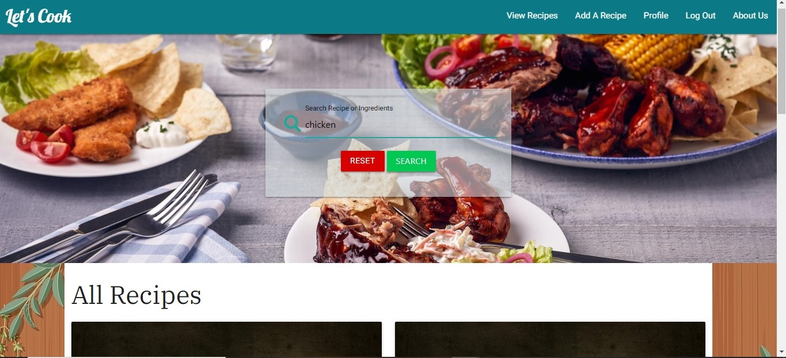
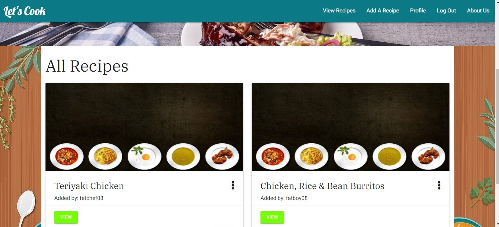

If a visitor of the website is interested on adding recipes to the website for others to view or try for themselves then the can register an account with the registration page when they created a username and password they get informed that their registration is completed, meaning that the user has been added to the database.  The username is not allowed to have spaces and are only allowed letter A to Z in lowercase or uppercase and numbers and no special characters.

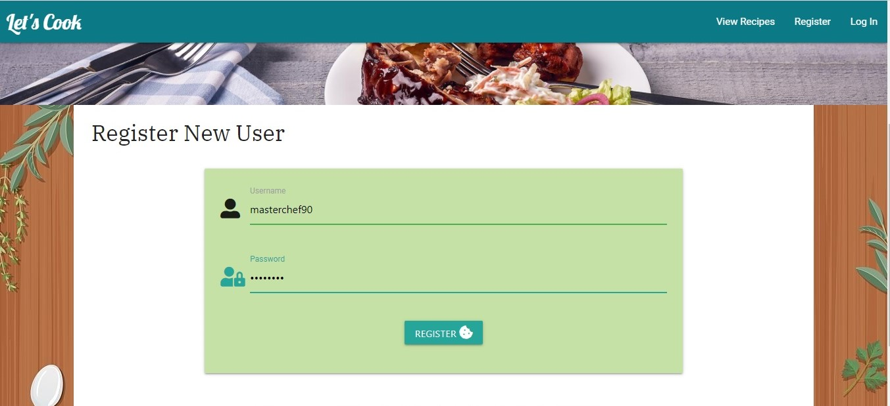
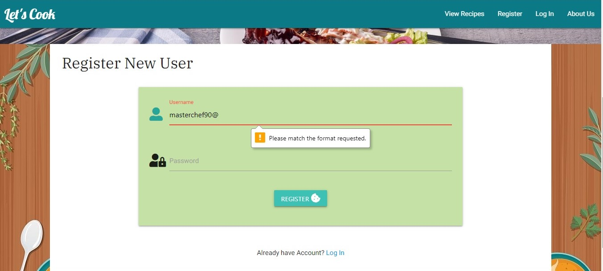
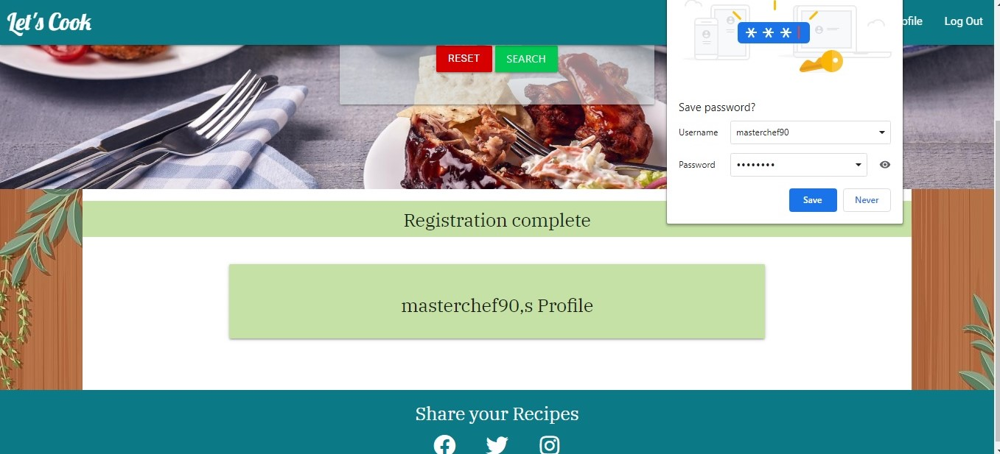
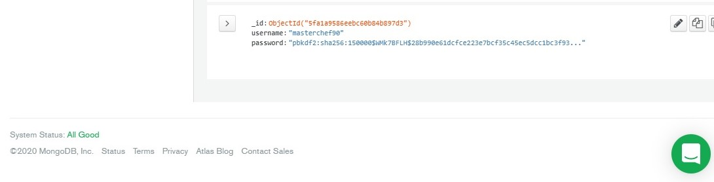
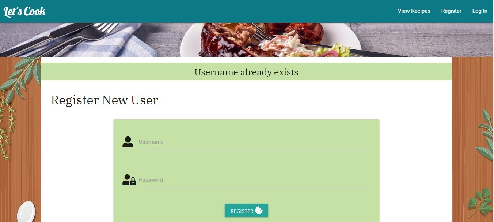

For the log in page the user just needs to enter their username and password that they used when they registered but if that doesn’t match the an message appears telling them that the have either typed the password or username wrong leaving it up to the user to figure out which one it is the inputted wrong. Once successfully logged in you get directed your profile page.

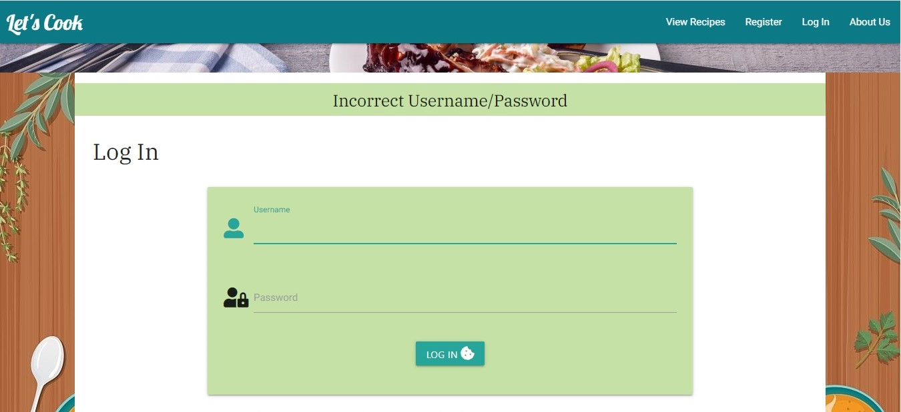

For those that have created an account on the website they now can add, edit, and delete recipes, but the delete and edit function the users can only delete the recipes they added. For guest that do not have an account they can only view recipes. 

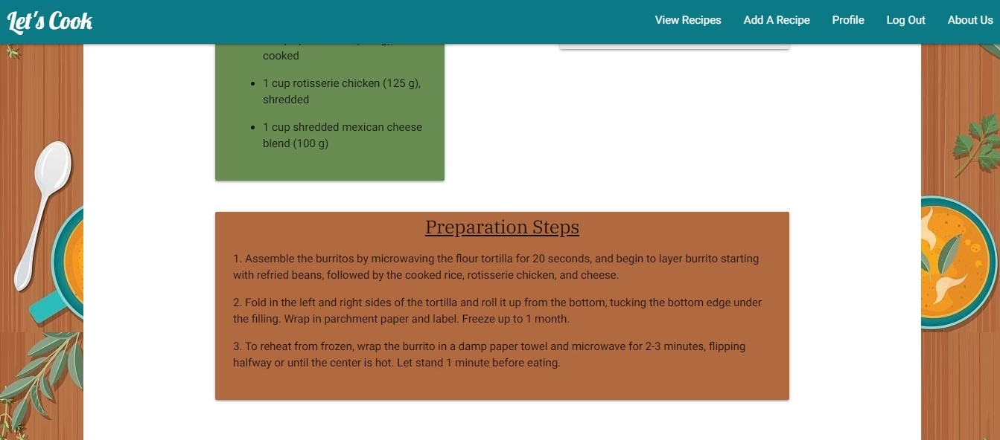

The way the account holder can edit or delete their recipes is just to click on the view button that located on the recipe card that redirects them to that specific recipe where if they added by the user the edit and delete button will be visible. On another note the admin account user can also have access to the edit and delete function for all the recipes

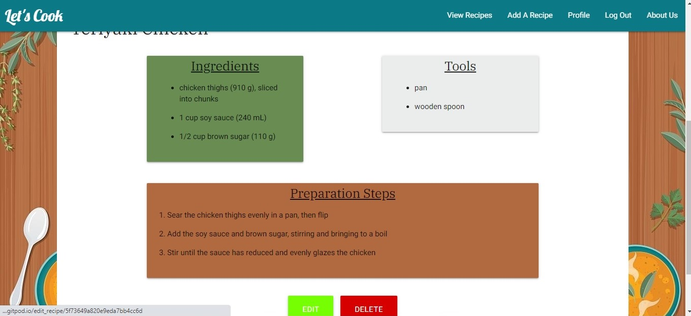

After logging into the site they are directed  to their profile page where they can see all the recipes they have added to the database from there they can click on the view button there which is the gateway to editing and deleting their recipes.

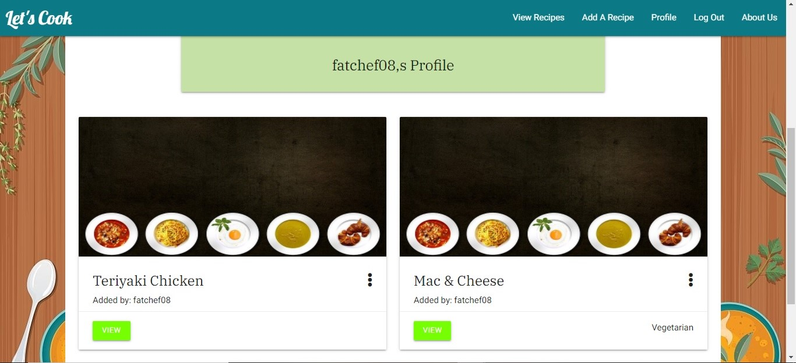

When an account holder clicks on the add recipe it take the users to a add recipe form where  if they wish to add an recipe they have to filling out all the inputs the form is asking expect for the tools field in case no tools are needed for the recipe, otherwise the recipe wont get added to the database and a promote telling the user they are need to fill out this field. For the fields such as tools, ingredients and preparations steps have an add button so the can add more than one field when needs be because as you can imagine recipes have need multiple ingredients, preparation steps and tools to cook the dish. When they have finished filling out the form the click on the add recipe button, where the user gets taken to the homepage with a message informing the user that the recipe has be added.

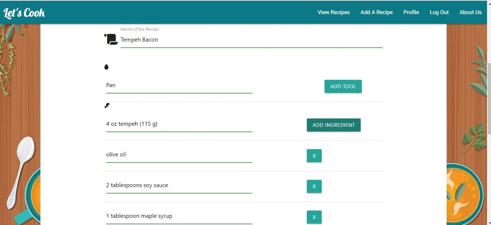
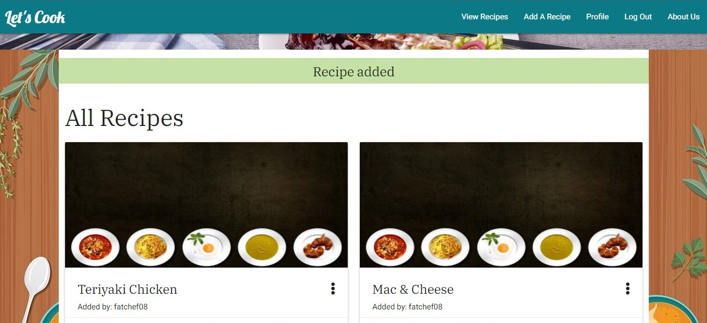
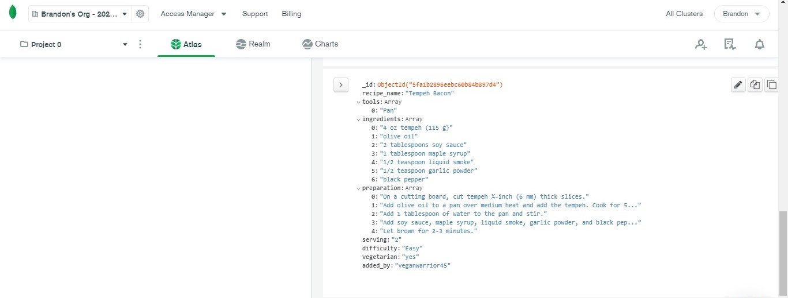

When user clicks on the edit button it takes them to a form that is the same of the add recipe form but with the fields already filled out with the information that was supplied before. With this this allows the user to remove or update any field and when they are done with their alterations with all the fields filled out they can click on the edit recipe button taking them to the homepage where they will be introduced to a message also telling them that their recipe has been updated. But if on realisation upon clicking on the edit the user changes he or she mind they have the option to click on the cancel button which just navigates them back to the home page.

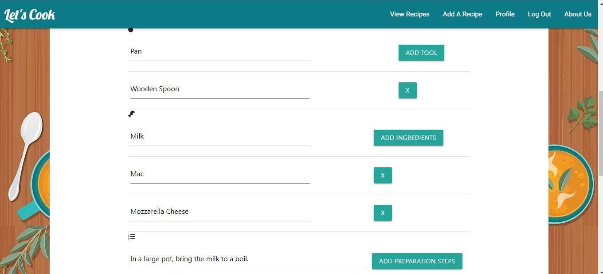
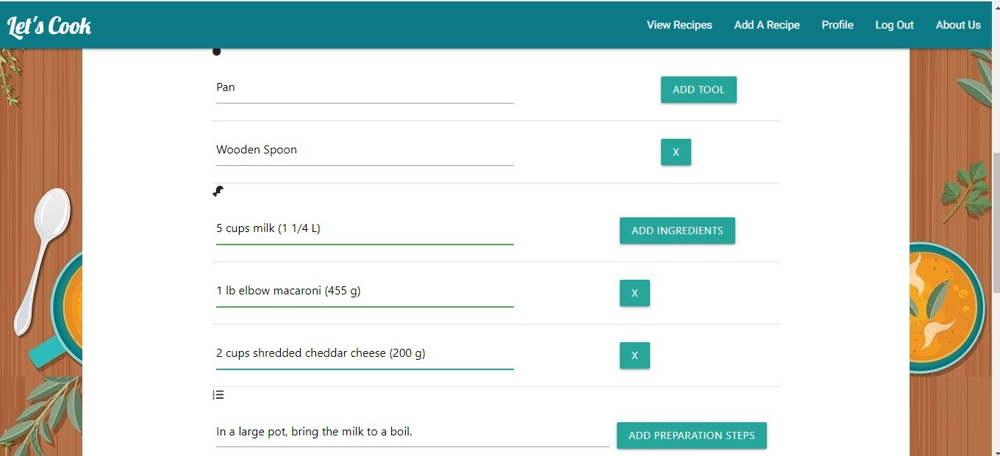
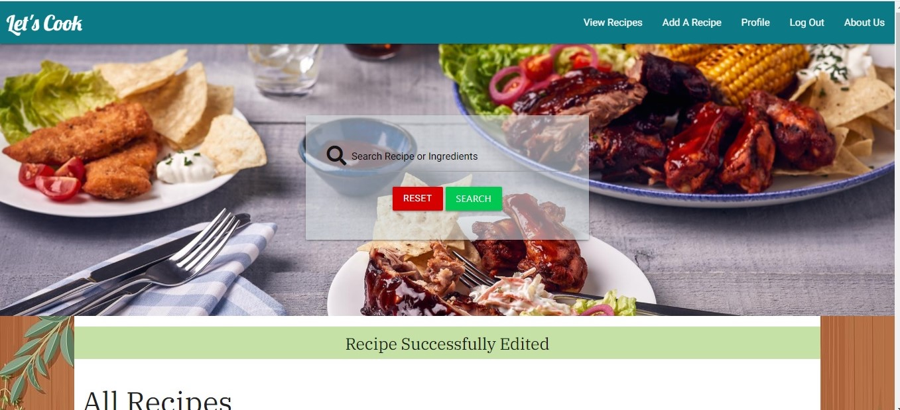

The navigation bar when you first enter the website only gives you the options to view recipes, log in and register but if you log in or register an account the navbar gives you more  additional options such as add recipe, profile and log out, while removing the register and log in buttons since they are irrelevant when the user has logged in or registered. But logged in or not you can still access the view recipes page from the navbar.

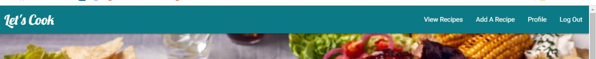

### Deployment
The website is hosted using Heroku that connected to GitHub, the master branch is then deployed to Heroku automatically so when new commits get added to Github they get transferred straightaway to Heroku. To do this I needed to create environment variables, requirements.txt file and a Procfile because these are thing Heroku needs to deploy our code and create an app for it. Heroku gives us platform to deploy our code a server for anybody in the world to access through the internet. To run my code locally I ran the app on python which opens port 8080 which allows me the open the app on the browser.

## Credits 

### Content
The recipes in the database come for the tasty.co website including all the information such as the name of the recipe, tools, ingredients, preparation steps, and number of people serving.

### Media 
All the images on this website have been collected from secondary sources, mostly from advanced google image search. Example such as the BBQ platter hero image, the side banner and multiple dishes image that is place on the recipe card.

#### Image sources
* BBQ platter source: https://www.parkdeanresorts.co.uk/~/media/parkdean-resorts/retail/bbq-sharing-platter-hero.ashx?rev=9526dfba71114651bd4ceef1cc42b4ea&w=1980 
* Side banner source: https://www.gettyimages.co.uk/detail/illustration/food-cooking-flat-lay-vertical-banner-with-royalty-free-illustration/625382396
* Multiple dish image source: https://canalplus-australie.com/wp-content/uploads/2018/06/dish-egg-food-54455.jpg 

### Acknowledgements
For the completion project I will have to give acknowledgement to the coding institute tutor and my mentor for aided me throughout this project and being available to help when needed.

Before starting this project, I some did research on different recipes sites, while looking  for inspiration from a few websites such as https://tasty.co/ and https://www.epicurious.com/  examining their layout, colour scheme, pictures and content.

The coding institute Putting It All Together Mini Project Task manager and other lessons like how to render templates, using frameworks such as flask, deploying a project to Heroku,  and creating a database use MongoDB  were a big inspiration to this project plus with all these lessons  that allowing me to use the knowledge I have received from the coding institute and applying to my project.

During this project there were a few obstacles that I needed to overcome but with the assistant of websites such as stackflow, w3schools.com, www.programcreek.com and, www.codegrepper.com helped me find solutions for some of the problems that I encountered during this project.
